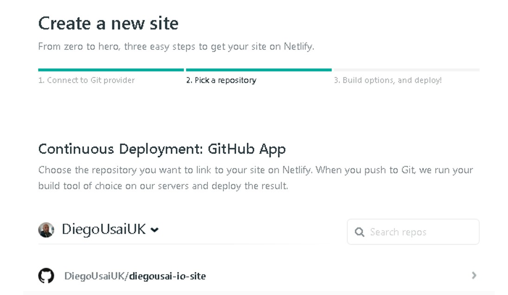

```{r setup, include=FALSE}
knitr::opts_chunk$set(
  eval    = TRUE,      # TRUE to evaluate every single chunck
  warning = FALSE,     # FALSE to suppress warnings from being shown
  message = FALSE,     # FALSE to avoid package loading messages
  cache   = FALSE,     # TRUE to save every single chunck to a folder
  out.width = "70%",
  out.height = "90%",
  fig.align = "center"
)
```
```{r switch off locale, include=FALSE}
# turn off locale-specific sorting for messages in English
Sys.setlocale("LC_TIME", "C")
```

```{r Load libraries, message = FALSE, include = FALSE} 
library(blogdown)
library(knitr)
``` 


This year has been rather rewarding for me! After completing some of the excellent [__Business Science University__](https://university.business-science.io/) courses, I have worked on a number of __Customer Analytics__ & __Business Intelligence__ projects and summarised them into technical articles that I published on __Medium__'s [__Towards Data Science__](https://towardsdatascience.com/@diegousaiuk). This opened up an entirely new world to me and generated many new connections within the __analytics and data science community__ the world over! 

The idea to __create my own website__ has been at the back of my mind for a few months. So far I've used [__RPubs.com__](https://rpubs.com/) (the _free web publishing_ service from __RStudio__) as [__a portfolio of sorts__](https://rpubs.com/diegousai) but I knew I needed a personal web-space. That would give me the freedom to __showcase my work in a more professional way__, accommodate articles that I didn't necessarily want to publish, and personalise with links to favourite blogs/books/sites as well as my social media platform ([ _LinkedIn_](https://www.linkedin.com/in/diegousaiuk), [ _GitHub_](https://github.com/DiegoUsaiUK), [ _Medium_](https://medium.com/@diegousaiuk), etc.).

When [__Matt Dancho__](https://www.linkedin.com/in/mattdancho) got in touch in early October 2019 to say that he liked a number of my articles and wanted to feature some of them on [__his blog__](https://www.business-science.io/blog/index.html), I knew I could no longer wait. So I put on hold the project I was working on and I gave myself _a week_ to come up with a _minimum viable product_ to put online.

8 days later, I was super excited to deploy [__diegousai.io__](https://diegousai.io/)!

And _Matt Dancho_ has even been kind enough to __feature my newly created webpage__ on his _23-Oct-2019_ webinar [__SQL for Data Science__](https://github.com/business-science/presentations/tree/master/2019_10_23_lab_21_SQL_for_Data_Science)!

```{r 0_learninglab, echo=FALSE}

```

## Overview

In this post I'm going to share what I've learned from my website building adventure. As I'm not a web developer nor a programmer, there have been moments where I though to myself __"What heck of a rabbit hole have I fell into?"__. 

Thankfully, there are plenty of __blog articles__, __online books__ and __developer forums__, all with varying degree of technical detail. Here I'm going to show what worked for me and will reference all the material I've sifted through and the approaches I've applied it my many trial-and-error runs.

As it is always the case with these things, I'm sure there are more straightforward ways get to the same result so I genuinely welcome tips and suggestions on how the process could be streamlined and improved.


## Some preliminary readings

This is some of the material I have referred to more or less consistently throughout the process: 

* The [__blogdown: Creating Websites with R Markdown__](https://bookdown.org/yihui/blogdown/) book, which has plenty of accessible information and useful tips. 
* The [__Academic__](https://sourcethemes.com/academic/docs/) framework documentation also has lots of information, albeit more technical.
* _Alison Hill_ blogpost [__Up & Running with blogdown__](https://alison.rbind.io/post/2017-06-12-up-and-running-with-blogdown/) has provided plenty of inspiration
* Another post I would recommend is _Martin Frigaard_'s article, [__How to build a website with Blogdown in R__](https://www.storybench.org/how-to-build-a-website-with-blogdown-in-r/), which has much more detail on __Git__ and __version control__.

## Assumptions, disclaimers,etc.

__Assumption #1__: I'm assuming that you're familiar with the __RStudio IDE__ and have already installed the __blogdown package__ and __Hugo__ on your machine. If not you can refer to the [__Get Started__](https://bookdown.org/yihui/blogdown/get-started.html) chapter of the blogdown book.

__Assumption #2__:  I'm also assuming that you already have a __Github repository__, which I will use to host my website. If not, you can create one for free [__here__](https://github.com/).

__Disclaimer__: This is not intended to be a technical guide as I'm not a web designer/developer nor a programmer. This is my report as an ordinary RStudio user on how I set up my blog using `blogdown`. I welcome comments and suggestions as I'm sure my process has a more streamlined flow to it.


## Create the website

Generating a webpage could not be any easier! 

### Pick a Hugo theme

First, you need to pick a theme. Currently, there are [_hundreds of themes_](https://themes.gohugo.io) you can choose from on the Hugo website and it's worth spending a few minutes perusing the list and try a few of the demo versions to get a feel for the final product.

Some of the themes that stood out for me are:

- [__Academic__](https://themes.gohugo.io/academic/): This is probably the most popular theme and, as the name suggests, it draws inspiration from the academic world. It is _highly customisable_ with plenty of _widgets and extensions_, is _well documented_ and has a _large community_ supporting it. However, the number of features and customisations may prove be a bit daunting to get your head around, especially if you're a novice like myself, so you may want to pick a simpler theme to start off with.

- [__Future Imperfect Slim__](https://themes.gohugo.io/hugo-future-imperfect-slim/): I really did like this Theme! It's streamlined and very responsive and comes with _multilingual integration_ and an extensive sets of _Social Media icons_ to link all your accounts. Unfortunately, in August 2019 a [__bug__](https://github.com/pacollins/hugo-future-imperfect-slim/issues/68) which prevents some of the posts to show on the main page has emerged. As of October 2019 the issue is still unresolved but hopefully this will get sorted out soon. 

- [__Casper Two__](https://github.com/eueung/hugo-casper-two): I chose this theme because is has a relatively simple structure, which makes it easy to navigate and personalise, and has just the right amount of _Social Media_ links for me. __And it's beautiful!__ 

  - However, __be aware that__ that this theme appears to be currently __NOT SUPPORTED__ by its developer and as such has been removed from the [_Hugo Themes Page_](https://themes.gohugo.io). This may result in "code breakages" when a new _Hugo_ update is released (in fact I've already encountered and fixed one!) but given the simplicity of the theme structure and code supporting it, I'm hoping that will push me to learn more about HTML and CSS to maintain my site going ahead.

Once you've decided which theme suits you best, click on the `Homepage` button on its Theme page. This will take you to the github repository housing the theme. Here's the Casper-Two repository. 

```{r 1_github_theme_repo, echo=FALSE}

```

Take a look at the top left-hand side of the page: this tells you that the theme is owned by `eueung` and it's housed in the `hugo-casper-two` folder. Make a note of the location address (or copy it to clipboard). 

### Create a new project directory

You can now create a new project for your website: 

in RStudio, go to  __File → New Project → New Directory → Website using Blogdown__

```{r 2_website_using_blogdown, echo=FALSE}

```

In the following page, pick a _directory name_ for your website and write/paste the github _theme location_ from the previous step

```{r 3_create_new_website, echo=FALSE}

```

You can now hit `Create Project` and RStudio will import all files from the Github repository and populate the new directory with a series of folders. 

#### The directory structure

Let's take a look at the folder structure that has just been created

```{r 6_folder_str, echo=FALSE} 

```

- `config.toml`: is the main interface to your website and contains all the global option to _personalise your site's content_
    - Most parameters are self explanatory but more details can be found on the [__Configuration__](https://bookdown.org/yihui/blogdown/configuration.html) chapter of the _blogdown book_
    
- `content`: all your material ( _articles, projects, posts, "About me" page, CV, etc_) is added and stored here

- `static`: is the folder where _images and videos_ are kept
  - If one of your posts outputs a chart or graph, it will be stored here
  
- `blogdown`: _cache files_ created by your posts are saved here

- `public`: the final html files and site structure gets stored here when Hugo creates your website. This is the _static version of the blog_ we will use to deploy to our domain. 

- `themes`: contains all the formatting for the theme and __should be left untouched__. I'll look into how to override some of the theme formatting __later in the post__.

## Build the website

You are now ready to create your website and you have a few options to do just that.

#### 1 - build_site()

Run `build_site()` in the command line to build a ready-for-publishing site

#### 2 - serve_site()

Use `serve_site()` instead to create a __local live preview__ of your website for testing. 

This means that your PC is __working as a server__ for your website, in much a _similar way_ to when you're building a __Shiny app__ and visualise it on your machine before deploying it.

This also has a `Serve Site` Addin version

```{r 4_serve_site, echo=FALSE}

```

### Project options

You are probably going to spend some time making changes to the `config.toml`file to personalise your website and run `Serve Site` several times to see the results. 

One thing to be aware of is that whenever you run `Serve Site` your site remains active, and every change you make to the `config.toml` file (or any other file that feeds into your site) will trigger a re-render of your website, which can prove a bit annoying! 

To prevent that, there is something you can change in the `Project Options` settings. Go to __Tools → Project Options → Build Tools__ and un-tick the `Re-knit current preview` box. 

```{r 5_project_options, echo=FALSE}

```

Now you can make and save several changes in a row but remember that to visualise them you'll need to re-run `Serve Site` every single time.

## Customise the theme

Typically, there are two way to customise your theme: 

#### 1 - Change `config.toml` parameters  

Keep in mind that this is restricted to the options that the theme developer made available. For instance, to change the entries in your __Main Menu__, you can use the _Categories_ that you assign to each article. 

Say for argument's sake that you have 4 articles you've assigned to the `Data` category. By changing the URL to `/categories/data` you generate a new entry in the main menu called `Data` which will show all 4 articles. 

```{r, eval = FALSE}
[[menu.main]] 
name = “Data” 
url = “/categories/data” 
weight = 120
```

The `weight` parameter controls the relative position on the menu: the higher the weight, the further left the category will appear.

#### 2 - Override individual `HTML`/`CSS` code

This is a bit more convoluted: if you want to override a certain aspect of the site's look or functionality, you __need to know which piece of code governs that particular aspect__. In my case, that  involved an awful lot of reading of online Hugo and HTML/CSS forums.

All key files are in `Themes` under the `layouts` and `static` folders:

```{r 7_theme_folder_str, echo=FALSE}

```

If you want to change something that is controlled by, say, the __singles__ code in `themes/layouts/page`, you need to create a new folder called `layouts/page` under the project root and save an "override" version of the __singles__ code in that folder. 

The basic principle is that, when Hugo builds your site, it will look in the main folder first, find the override item and use that instead of the original one in the Themes folder. 

Let's go through one of the changes I've made and this will become much clearer.

### Custom CSS

I've found a way to change the website main title font and weight. These aspects are controlled by the __casper-two__ file stored in `themes/static/css`. Essentially, I created a new folder called `css` under the `static` main folder and put an "override" css file in it. 

You can use the original css file in the `Themes` folder as template and edit it directly in RStudio. Use the `CTRL+O` short-cut and go to __my_website_casper_two → themes → hugo-casper-two → static → css__ and load __casper-two__.  

Then paste the code below in the body of the file and save it as `overrides.css` under `static/css`.

```{r, eval = FALSE}
.site-title {
    font-weight: 200;
    font-size: 7rem;
}
.site-header:before {
    background: rgba(0, 0, 0, 0.5);
}
```

__DO NOT FORGET__ to edit __customCSS = [""]__ in your `config.toml` to __customCSS = ["css/overrides.css"]__ or Hugo will still use the original css file in the Theme folder.

## Add a post

Unless you're transferring your blog from another platform, like _Wordpress_ or _Jekyll_ (in which case you can refer to [__this__](https://bookdown.org/yihui/blogdown/migration.html)), you can simply add an existing .Rmd file to the `content` folder. 

Before hitting `Serve Site`, there are some changes to make to the .Rmd header:

- make sure you amend `categories` and `tags`

- update the path to the image that sits right under the title (do not forget to add the image in the `static/img` folder)

- you can also add a `slug`

```{r eval = FALSE}
---
title: "Using K-Means Clustering to Understand Marketing Response"
slug: a-gentle-introduction-to-customer-segmentation
author: "Diego Usai"
date: 2019-05-25
categories: ["ML Methods", "Articles"]
tags: ["Clustering", "Customer Segmentation"]
image: /img/nick-karvounis-SWIoVDRZWUY-unsplash.jpg
---
```

Now, the __slug__ works in conjunction with the `permalink` parameter you find in the `config.toml` file. I've set up my `permalink` as follows...

```{r, eval = FALSE}
[permalinks]
  post = "/:year/:month/:slug/"
```

...which means that the above article will have this permalink: 

http://diegousai.io/2019/05/a-gentle-introduction-to-customer-segmentation/ 

This is to guarantee that, should you want or need to __transfer your blog to another platform__, you _won't lose the back-links_ to your old blog and your article _will not suddenly "drop off" natural search results_.

To add a __brand new post__ you can use `New Post` Addin. I'm yet to test this facility so I will not comment on it in this post, but you can read about it [__here__](https://bookdown.org/yihui/blogdown/rstudio-ide.html)


## Fixing the Bugs

### Main page not showing posts

When you `Serve Site` for the first time, you will notice that the home page is pointing to the posts folder and this requires an additional click to show your posts.

```{r 8_main_page, echo=FALSE}

```

This is due to the fact that the `Casper-Two` Theme hasn’t been updated to work with Hugo 0.58 and later versions. Thankfully, I've come across this 
[__posts__](https://discourse.gohugo.io/t/hugo-casper-two-theme-home-page-redirect-issue/20817/2) that shows a quick solution.

Basically, as explained in the _Custom CSS_ paragraph, I've created a new  `layout/partials` folder under the project root with a copy of the `post-list` code in it. 

I then swapped the first line of the `post-list` code...
```{r post-list OLD, eval =FALSE}
{{ $paginator := .Paginate (where .Data.Pages.ByDate.Reverse "Type" "post") }}
```

... with this. 
```{r post-list NEW, eval =FALSE}
{{ $paginator := .Paginate (where .Site.RegularPages.ByDate.Reverse "Type" "post") }}
```

And hey presto, the problem was sorted!


### Multiple formatting issues

This was a more complex issue I only became aware of when I had already invested several days of work in the project. Basically, paragraphs do not render properly in mobile format, cutting off at the edges.

```{r 9_rmd_issue, echo=FALSE}

```

To make matter worst, external pictures would not show either, even when added through the `Insert image` Addin.

When I was seriously considering to re-start from scratch and switch to another theme, I decided to give myself another half day to search for solutions and thankfully bumped into this [_comment_](https://sourcethemes.com/academic/docs/front-matter/#rstudio) suggesting that if using RStudio, __"RMarkdown [files] should be saved with the .Rmarkdown extension rather than the .Rmd extension"__. 

Luckily, this sorted both issues, killing the proverbial 2 birds with one stone!

## Publish your site

Now you can deploy your website for the whole world to see. Due to the static nature of the site you've generated, this can be done in a large variety of ways. Here I'm going to show you how I got myself a __custom domain__, how I'm using my __github__ account to host my site, and how I've linked all to __Netlify__ for publishing. 

Admittedly, it took a little while to get all the plumbing and wiring properly aligned and sorted out but I'm really happy with the final result, which I'm sure can still be improved on so suggestions are more than welcome. 
And I'm especially happy with __how much I've learned__ in the process!

### Housekeeping tasks

* Make sure you change the `baseurl` in `config.toml` to your final one (“http://diegousai.io” in my case)
  
* Make your site and its entries searchable on SEO by enabling these:
  - `enableRobotsTXT`  = true
  - `canonifyURLs`     = true

* You can add GoggleAnalytics and Disqus if you want:
  - `googleAnalytics`  = "XX-123456789-1"
  - `disqusShortname`  = "your-disqus-id"

### Github

First, I created a __Github__ repository to house all my files. At this stage I could can either:

- __Link my R project to the GitHub repository__ (see [_here_](https://happygitwithr.com/rstudio-git-GitHub.html) for how to do that) and "push" the `public/` folder to GitHub from RStudio.

- __Commit my R project via upload__ by manually drop the `public/` folder to the github repository.

Given the tight time frame on this project I've opted for the manual upload. I will further explore the first option in the near future


### Netlify
[__Netlify__](https://www.netlify.com/) offers hosting and server-less backend services for static websites, and is widely recommended by the large majority of sources I've come across - you can check [_here_](https://sourcethemes.com/academic/docs/deployment/),  [_here_](https://alison.rbind.io/post/2017-06-12-up-and-running-with-blogdown/#deploy-in-netlify), and [_here_](https://bookdown.org/yihui/blogdown/netlify.html). 

Once I created a __basic account for free__, I could __publish a website in minutes__ by drag-n-drop the `public/` folder through their web interface. But what I set out to do was to deploy my website directly from Github.

To do that, I first need to link Netlify to the relevant Github repository: from the `Sites` tab in Netlify, click on `New site from Git` and select `GitHub` to grant it access to your repositories.
```{r 10_netlify_github_1, echo=FALSE}

```

Once you've authorised Netlify, you can search and locate the website repository for your site (in my case `diegousai-io-site`)

```{r 11_netlify_github_2, echo=FALSE}

```

The next step is to set the build options. Make sure to leave the `build` window blank (it plays up otherwise) and point the _Publish Directory_ to `public/`.

```{r 12_netlify_github_3, echo=FALSE}

```

Click on `Deploy site` and Netlify bots will concoct all files into your website for you. 

### Custom Domain

With Netlify, your site gets assigned a rather impersonal subdomain along the lines of `random.word-random.word-blahblahblah.netlify.com`, which I really did want to personalise! So I got on [__Namecheap__](https://www.namecheap.com) and bought myself a handful of __custom domain__ names for a bargain price, including the one I'm using for my website: __diegousai.io__. 

Last thing you need to do is to tell Netlify to use your personal domain instead of its random-generated one. On your __Netlify__ homepage Navigation bar, click on `Domains` and select `Add or register domain`.

```{r 13_custom_domain_1, echo=FALSE}

```

Follow the instructions and you will be provided with some `nameservers` codes (usually 4 of them), which are used to link you website and you domain. Now, go back to [__Namecheap__](https://www.namecheap.com), enter `Domain List` and select the relevant one with `manage` and on the `domain` tab scroll to `nameservers`,  type the 4 codes you got from Netlify and save.

```{r 14_custom_domain_2, echo=FALSE}

```

To verify that this worked, check if the __Netlify__ site changed its _random domain_ name to your __custom domain__.

```{r 15_custom_domain_3, echo=FALSE}

```

## Enable SEO

Although this theme supports SEO elements, enabling `enableRobotsTXT` and `canonifyURLs` in your `config.toml` is not enough to have your site and its content appear on SEO results. In my many readings, I've found some instructions on how to do just that on the _Future Imperfect Original Theme_ [__github README.md__](https://github.com/jpescador/hugo-future-imperfect).

Bear with me here because I'm very much __outside my comfort zone__ so __tips and suggestions are more then welcome__!

__First__, you need to create an account on [__Google Search Console__](https://search.google.com/search-console/about) and __Add your website as your own property__. Once you've done so, google will ask you to __verify domain ownership via DNS record__ and will give you these instructions:

1. Sign in to domain name provider
    - __Netlify__ in my case as I've delegated domain name handling from __Namecheap__

2. Copy TXT record into DNS configuration for __diegousai.io__

__Next__, go to your __Netlify__ homepage Navigation bar, click on `Domains` and under `DNS records` select `Add new record` and paste the TXT record you got from google.

__Then__, you should __Submit the sitemap__ (/sitemap.xml) for indexing but for some obscure reason, this only worked once for me: after many attempts Google Console loaded the sitemap only to tell me it was incomplete. I've then deleted it and have been unable to load the new one.

__However__, I've managed to submit both _diegousai.io_ and _www.diegousai.io_ for inspection with the `URL inspection` option and my site and some of its pages started to appear on SEO results.

This is still a __work in progress__ so do take my instructions with a huge pinch of salt!
 

## Closing thoughts

As a statistical analyst, learning the basics of website construction could be a daunting prospect. Sure, I could've opted for managed online site builders such as [__SquareSpace__](https://www.squarespace.com/) or [__WordPress__](https://wordpress.com/) but I would not have learned half as much as I did! And it wouldn't have been half as rewarding! 

Although I did find myself wondering a couple of times __what devil possessed me to get into this__ (especially when it comes to SEO), all in all I'm rather happy with what I've achieved! 

I learned lots of new concepts and ideas and I now have a really functional and nice looking webspace that should serve me well for some time to come.


### Some tips

I would like to close this post with a couple of tips that I hope others embarking on the journey would find useful.

__TIP #1__: one thing that worked really well for me was to add one of my articles to the `content` folder and __create a few "prototypes"__ using different themes. This gave me not only the chance to __see how my article would look like in the "finished product"__ but also allowed me to check if charts, code chunks and imported pictures were __all rendered all right__. 

This is how I found out about the _Future Imperfect Slim_ bug I mentioned earlier, and that .Rmd files struggle to show imported pictures. 

__TIP #2__: do not forget to check if everything works fine in __MOBILE VIEW!!!__. Although the RStudio _Viewer pane_ provides a mobile-like rendering, it is worth visualising your website in a browser and "shrink" the page to mimic a mobile view. 

This revealed the issue that in mobile format, paragraphs cut off at the edges in _Casper Two_, which I've luckily managed to find a fix. 


### Code repository
The full R code can be found on [my GitHub profile](https://github.com/DiegoUsaiUK/build-your-website-with-hugo-and-blogdown/)


### References
* The [__blogdown: Creating Websites with R Markdown__](https://bookdown.org/yihui/blogdown/) book, which has plenty of accessible information and useful tips. 
* The [__Academic__](https://sourcethemes.com/academic/docs/) framework documentation also has lots of information, albeit more technical.
* _Alison Hill_ blogpost [__Up & Running with blogdown__](https://alison.rbind.io/post/2017-06-12-up-and-running-with-blogdown/) has provided plenty of inspiration
* Another post I would recommend is _Martin Frigaard_'s article, [__How to build a website with Blogdown in R__](https://www.storybench.org/how-to-build-a-website-with-blogdown-in-r/), which has much more detail on __Git__ and __version control__.
* [__Creating websites in R__](https://www.emilyzabor.com/tutorials/rmarkdown_websites_tutorial.html#types_of_websites) by _Emily C. Zabor_ is a detailed introduction to creating websites using R, R Markdown and GitHub pages.
* _Bingkai Wang_'s[_How to build a personal webpage in R_](https://infallible-jennings-0fe40d.netlify.com/blog/how-to-build-such-a-website/) for the nameservers suggestion
